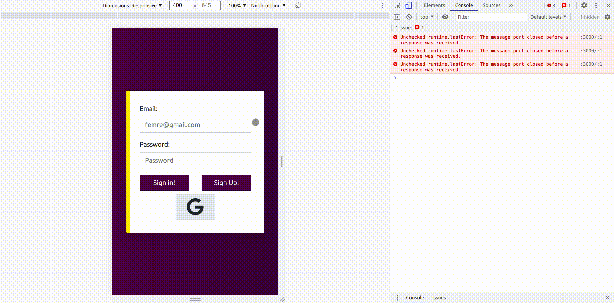

# ChatApp


### Table of Contents

 * [Introduction](introduction)
 * [Review](Review)
 * [Prerequisite](Prerequisite)
 * [Installation](Installation)
 * [Features](Features)
    * [Some Extra Ideas](Someextraideas) 
 * [Technologies](Technologies)

## Introduction

A simple chat app with user system.

### 👀 Review



## Prerequisite

- [Node.js & NPM](https://nodejs.org/en/download/)
- [Google OAuth API Key](https://developers.google.com/identity/protocols/oauth2) 
- [MongoDB](https://www.mongodb.com/)

### 👨‍💻 Installation

Clone repository
```bash
$ git clone https://github.com/femresirvan/ChatApp.git
$ cd ChatApp
```

Install dependencies
```bash
$ npm i
```

Configure .env
<!-- EDIT HERE  -->
```bash
➥ ~./env

MONGODB_URI="YOUR_MONGODB_CONN_STRING"
GOOGLE_ID=""
GOOGLE_SECRET=""
```

## Features

- User system.
- Chat system with websocket.
- Google Auth and cookie based authentication in the same app.
- Responsive design with that you can easily use on any device.

### Some extra ideas

<!-- EDIT HERE -->

- [ ] Add a simple test that provides you simply join a room when you can't decide.
- [ ] Add profile edit page and service.
- [x] Add `--passport.socket.io` to secure socket.io connections via OAuth and JWT technologies. 

### Technologies

- Socket io
- Gulp
- Node.js
- Bootstrap&Sass
- MongoDB
- Express.js
- Passport.js
- Google Oauth
- Rest API 
### License

<!-- EDIT HERE -->
MIT

### Contributes

> 🤝 Big thanks to [Sahat/Hackathon-Starter](https://github.com/sahat/hackathon-starter) that allows you easily start node.js applications.
